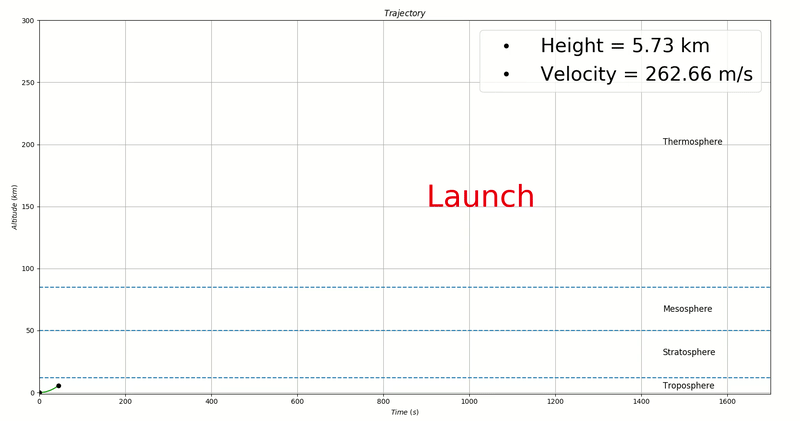
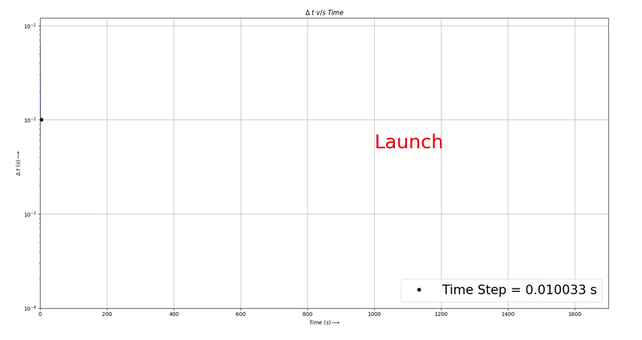

# Adaptive RK45 Rocket_Launch_Sim

## Rocket Launch Simulation using Adaptive RK 45 methods

Final project for the Numerical Methods (24703) course at CMU. Performed numerical simulation of the launch and propulsive re-entry of the first-stage of a multi-stage rocket. 

The simulation was performed using the Runge-Kutta Fehlberg method with adaptive time stepping. The rocket specifications were derived from SpaceX's Falcon-9 rocket

A reusable rocket launch mission can be broken down into the following critical stages:

  * **Launch** – The static launch of the rocket from the earth’s surface
  * **Stage Separation** – The rocket separates into two stages with the upper stage going into orbit and the lower stage returning back to earth. This project primarily focuses on the stage that re-enters the earth’s atmosphere
  * **Propulsive Re-entry** – Re-lighting of the engines during re-entry. This is used while the rocket is descending, in order to reduce the velocity sufficiently for safely deploying parachutes.
  * **Deploy Parachute** – Deploying parachutes in order to achieve a soft landing back to earth.

## Simulation Results

  - ### Trajectory of Rocket (Altitude v/s Time)

  - ### Adaptive Time Stepping for RK45 ( v/s Time)

